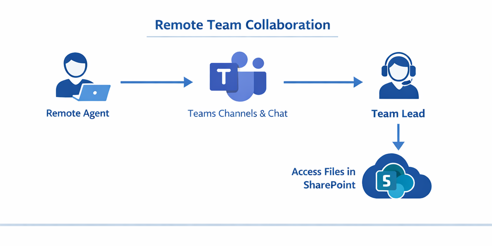

# Teams & SharePoint Access Model

## Overview
This repository documents a structured access and collaboration model for Microsoft Teams and SharePoint in a fully remote organization.  
It demonstrates how to securely onboard users, manage permissions, and maintain organized collaboration spaces while supporting rapid team scaling.

This model is designed for IT Support Specialists supporting distributed workforces using the Microsoft 365 ecosystem.

---

## Business Problem
Remote teams often face:
- Over-permissioned users
- Disorganized Teams channels
- SharePoint access confusion
- High volumes of access-related support tickets

This access model provides a **clear, repeatable framework** to reduce errors, improve security, and streamline onboarding.

---

## What This Covers
- Microsoft Teams channel structure (Public vs Private)
- SharePoint permission levels and inheritance
- User onboarding and access assignment workflow
- Role-based access control for remote teams
- Best practices for scaling Teams and SharePoint environments

---

## Architecture & Workflows

### Teams Channel Workflow
Defines how Teams are structured, including:
- Standard channels for collaboration
- Private channels for restricted data
- Ownership and member roles

---

### SharePoint Access Model
Illustrates permission assignment using:
- Owners
- Members
- Visitors
- Document library access controls

---

### User Onboarding Workflow
Shows the step-by-step process used when onboarding new remote users:
1. User account creation
2. License assignment
3. Teams membership
4. SharePoint access provisioning
5. Verification and validation

---

## How This Is Used in Practice
In a real IT support environment, this model helps:
- Onboard multiple new agents simultaneously
- Reduce access-related incidents
- Maintain consistent permission standards
- Improve collaboration without compromising security

This approach is especially useful during rapid growth phases.

---

## Tools & Technologies
- Microsoft 365 (Teams, SharePoint, Exchange)
- Azure Active Directory
- Role-Based Access Control (RBAC)
- Remote IT support best practices

---

## Author
**Hezron Mutua Peter**  
IT Support Specialist – Microsoft 365 & Remote Workforce Support  

